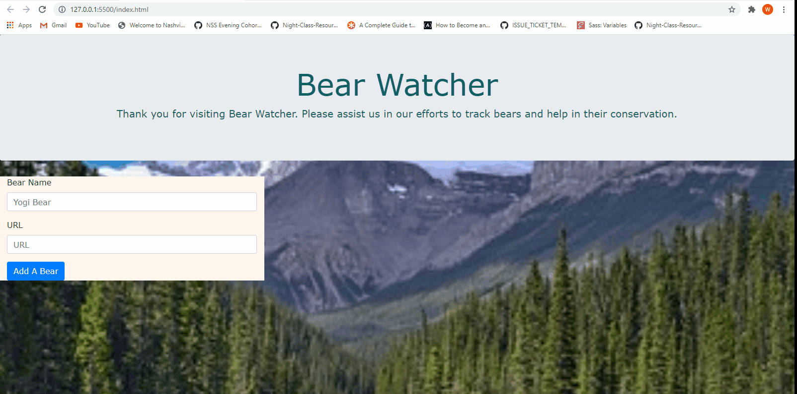

## Bear Watcher
The following project consists of an app that allows a user to input a bear name and image url. The user submits the information and generates a new 'bear-card' that displays the data. In theory, the app could be used for conservation efforts to track threatened or endangered bears or other species. 

## Motivation
The project was completed as part of an assignment for Nashville Software school. The project incorporates new skills learned at the time, including jQuery and using modules to organize code and files. I plan to modify the project with more complex elements such as buttons that input information (e.g.bear caught a fish).

## Demo

## Technologies Used
-HTML
-CSS
-Bootstrap
-JavaScript
-jQuery 
-GitHub
-VS Code

## Contributors
[Wanda McInturff](https://github.com/wmmcinturff)